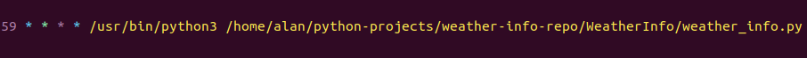
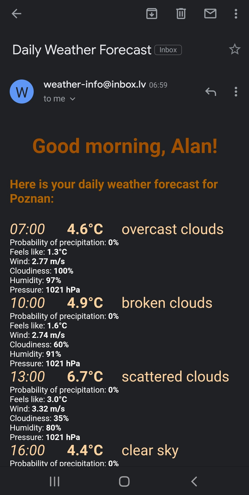
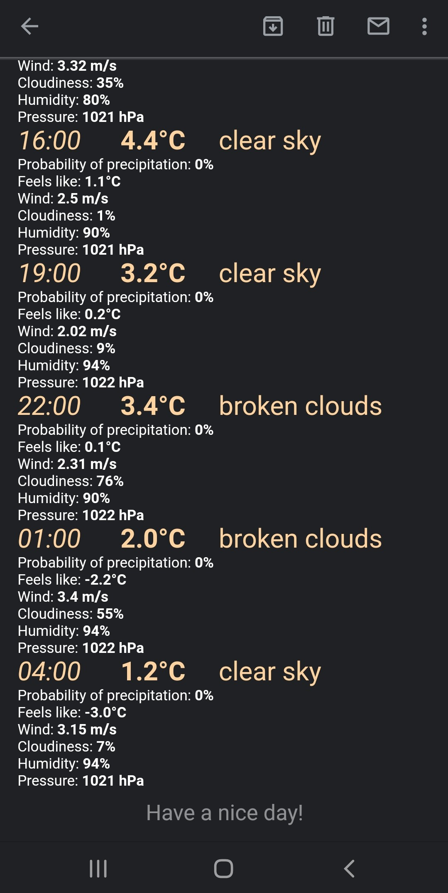

# Daily Weather Forecast
## Description
The purpose of the project was to automate the process of checking a weather forecast. Subscribers can choose days and hour when they will receive emails with weather information.
## How it works
Script *weather_info.py* is launched every hour (e.g. 6:59, 7:59, etc.) by *cron*.

While the program was running, all the application activities are storing in logfiles (e.g. *2020-11-25.log*).
###### Program steps:
* Gets the current date and time.

* Fetches selected users from the database. If there are no users, the script will exit.

* Logs in to the e-mail account using *smtplib*.

* Gets the weather forecast from *https://openweathermap.org/* via the API.

* Prepares and sends email messages to each user.

* Closes the connection to the SMTP server.

###### Example message (*Gmail Android App*)

## Technologies:
* Python 3
* MySQL
* cron
* API
* HTML, CSS
